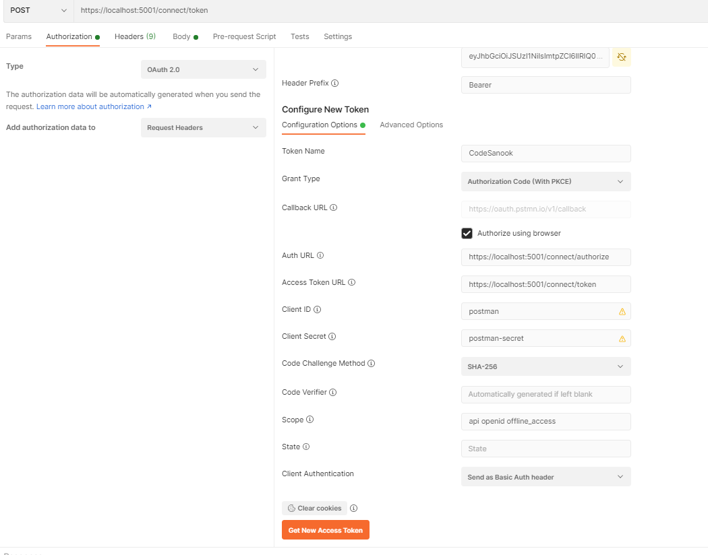

# Mild.MVC.Authentication.Openiddict.OAuth2.AuthorizationCodeRefreshToken

- Enable the the [Client Credentials Flow](https://oauth.net/2/grant-types/client-credentials/), which is suitable for **machine-to-machine** applications.

- Enable the [Authorization Code Flow with PKCE](https://oauth.net/2/grant-types/authorization-code/) which is the recommended flow for Single Page Applications (SPA) and native/mobile applications.

- Enable the [Refresh Token](https://oauth.net/2/grant-types/refresh-token/)

# Features
- MVC
- Cookie Authentication (SSR) 
- Razor Page controlled by the Controller
- Session Management 
- Use `Openiddict` for OAuth2 

# Limitation
- No connect to any DB

<!-- more -->

# Run

```sh
dotnet run
```

Open browser: https://localhost:5001/


# Postman Test Config



# Quick manual setup 
```
dotnet new webapp -o AuthorizeServer
See Diff: https://github.com/codesanook/codesanook-examples/commit/daaa4cdfe48b28d87c8b9acde6d2485be69a53de
```

# Ref
Setting up an Authorization Server with OpenIddict - Part 4 - 6

- Part 4. [https://dev.to/.../setting-up-an-authorization-server...](https://dev.to/robinvanderknaap/setting-up-an-authorization-server-with-openiddict-part-iv-authorization-code-flow-3eh8?fbclid=IwAR0jLDgpiafp50Oe1EIjncV-A7RsigIxWRO4iG6J8pYpYY1mf16Sdv8r4gs)
- Part 5. [https://dev.to/.../setting-up-an-authorization-server...](https://dev.to/robinvanderknaap/setting-up-an-authorization-server-with-openiddict-part-v-openid-connect-a8j?fbclid=IwAR2jYkNffApAoI32iFusCAQa-4lhVgXS_AydjL5V_q2-RZz9bk22DqpcnpU)
- Part 6. [https://dev.to/.../setting-up-an-authorization-server...](https://dev.to/robinvanderknaap/setting-up-an-authorization-server-with-openiddict-part-vi-refresh-tokens-5669?fbclid=IwAR3g6oJZ2LEyHdgA33z12x2yXPJQm_DXllbbaYu5nNT4JQyAxyFIdtNwpRY)